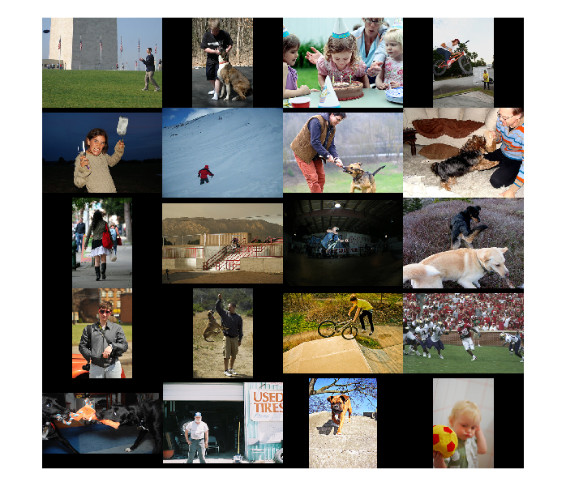
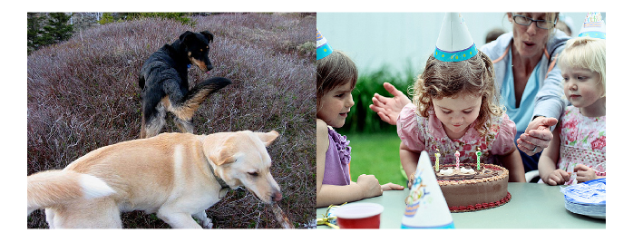
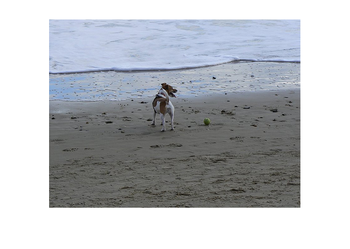

# openai-clip-matlab
[](https://matlab.mathworks.com/open/github/v1?repo=Lxrd-AJ/openai-clip-matlab&file=playground.mlx)

MATLAB implementation of the OpenAI CLIP deep learning model

# CLIP Interface
```matlab
if ~isfile("net-gpu-poor-squeezenet-bert-tiny.mat")
    !curl -O https://github.com/Lxrd-AJ/openai-clip-matlab/releases/download/v1.0.0/net-gpu-poor-squeezenet-bert-tiny.mat
end

load net-gpu-poor-squeezenet-bert-tiny.mat net logTemperature
```

```matlab
imageInputSize = net.Layers(1).Layers(1).InputSize(1:2);
clip = CLIP(net, Temperature=exp(logTemperature), ImageInputSize=imageInputSize)
```

```matlabTextOutput
clip = 
  CLIP with no properties.

```

```matlab
% Try encoding some images

% First gather all image paths from the dataset
imgBaseDir = "./flickr-dataset/Flicker8k_Dataset/";
% folderContents = dir(imgBaseDir);
% boolImagesInFolder = arrayfun(@(x) ~x.isdir, folderContents);
% folderContents = folderContents(boolImagesInFolder);
% imagePaths = arrayfun(@(s) fullfile(s.folder, s.name), folderContents, UniformOutput=false)
% allImagePaths = string(imagePaths);

% Test Images
devImages = readlines("flickr-dataset/Flickr_8k.devImages.txt");
devImages = fullfile(imgBaseDir, devImages);

% Get some random images from the dataset
someImagePaths = randsample(devImages, 20);

```

```matlab
%imshow(imread(someImagePaths(1)));
images = arrayfun(@(x) imread(x), someImagePaths, UniformOutput=false);
montage(images)
```



```matlab
%imageEmbeddings = clip.encodeImagesAt(someImagePaths);
[probs, logits] = clip.predict(someImagePaths, ["two Dogs", "Birthday Party"]);
disp(probs)
```

```matlabTextOutput
  20x2 single gpuArray dlarray

    0.0000    0.0003
    0.0000    0.0000
    0.0000    0.9989
    0.0000    0.0005
    0.0000    0.0001
    0.0000    0.0000
    0.0000    0.0000
    0.0000    0.0000
    0.0000    0.0000
    0.0000    0.0000
    0.0000    0.0000
    0.9998    0.0000
    0.0000    0.0000
    0.0000    0.0000
    0.0000    0.0000
    0.0000    0.0000
    0.0002    0.0000
    0.0000    0.0002
    0.0000    0.0000
    0.0000    0.0000
```

```matlab
[maxProb, maxIdx] = max(extractdata(gather(probs)));
disp("Query Match Probability: " + maxProb)
```

```matlabTextOutput
    "Query Match Probability: 0.99983"    "Query Match Probability: 0.99886"
```

```matlab

maxImages = {};
for idx=1:numel(maxIdx)
    maxImages{end+1} = imread(someImagePaths(maxIdx(idx)));
end
montage(maxImages)
```



```matlab
% im2imLogits = imageEmbeddings' * imageEmbeddings * 40; % temperature of 100
% im2imProbs = softmax(im2imLogits, "DataFormat", "SC")
% % Visually check that the last 2x2 submatrix is not equal to 1, should be
% % around 0.5
% disp("The last 2 duplicated images")
% im2imProbs(end-1:end, end-1:end)
```

## Other Notes
```matlab
datastore = CLIPDatastore(ImageFolder="./flickr-dataset/Flicker8k_Dataset");
ds = shuffle(datastore, "PercentageToKeep", 1)
```

```matlabTextOutput
ds = 
  CLIPDatastore with no properties.

```

```matlab
disp("Number of training images " + numel(ds))
```

```matlabTextOutput
Number of training images 30000
```

```matlab

testDatastore = CLIPDatastore(ImageFolder="./flickr-dataset/Flicker8k_Dataset", TrainTestVal="./flickr-dataset/Flickr_8k.testImages.txt");
tds = shuffle(testDatastore, "PercentageToKeep", 1)
```

```matlabTextOutput
tds = 
  CLIPDatastore with no properties.

```

```matlab
disp("Number of test images " + numel(tds))
```

```matlabTextOutput
Number of test images 5000
```

```matlab
[net,tokenizer] = bert();
```

```matlab
r = read(ds)
```
| |1|2|3|
|:--:|:--:|:--:|:--:|
|1|375x500x3 uint8|1x19 double|"A brown and white dog be stand on a beach with a tennis ball beside it ."|

```matlab
[im, tokens, caption] = r{:};
imshow(im)
```



```matlab
%caption = "A group of horse and their rider be race each other .";
[~, segments] = encode(tokenizer, caption);

dltoken = dlarray(tokens, 'CT');
dlsegment = dlarray(segments{1}, 'CT');
mask = dlarray(ones(1, numel(dlsegment)), 'CT');

pred = predict(net, dltoken, mask, dlsegment);

decodedTokens = decode(tokenizer, tokens)
```

```matlabTextOutput
decodedTokens = "[CLS] a brown and white dog be stand on a beach with a tennis ball beside it . [SEP]"
```

```matlab
disp(size(pred))
```

```matlabTextOutput
   768    19
```

```matlab
last = pred(:,1) % Use the [CLS] token but the official CLIP implementation trained their own text encoder and used the last token's embedding
```

```matlabTextOutput
last = 
  768(C) x 1(T) single dlarray

   -0.1619
    0.1122
    0.0165
    0.2698
    0.4631
   -0.1553
   -0.8530
     ...
   -0.6838
    0.0352
    0.1187
   -0.6164
    0.5134
    0.2817
   -0.7342
    0.0385
    0.1096
   -0.1773
   -0.6413

  768(C) x 1(T) single dlarray

```


```matlab
% NB: Using Bert for batched prediction
[net, tokenizer] = bert() %bert("Model","tiny");
```

```matlabTextOutput
net = 
  dlnetwork with properties:

         Layers: [129x1 nnet.cnn.layer.Layer]
    Connections: [164x2 table]
     Learnables: [197x3 table]
          State: [0x3 table]
     InputNames: {'input_ids'  'attention_mask'  'seg_ids'}
    OutputNames: {'enc12_layernorm2'}
    Initialized: 1

  View summary with summary.

tokenizer = 
  bertTokenizer with properties:

        IgnoreCase: 1
      StripAccents: 1
      PaddingToken: "[PAD]"
       PaddingCode: 1
        StartToken: "[CLS]"
         StartCode: 102
      UnknownToken: "[UNK]"
       UnknownCode: 101
    SeparatorToken: "[SEP]"
     SeparatorCode: 103
       ContextSize: 512

```

```matlab
paddingValue = tokenizer.PaddingCode;
str = [
    "Coolant is pooling underneath sorter."
    "Sorter blows fuses at start up."
    "There are some very loud rattling sounds coming from the assembler."];
[inputIdsStr, segmentIdsStr] = encode(tokenizer, str);

% The `maskStr` is used to specify the indices of the `paddingValue` so
% that the model ignores the padding
[inputIdsStr, maskStr] = padsequences(inputIdsStr, 2,"PaddingValue",paddingValue);
segmentIdsStr = padsequences(segmentIdsStr, 2,"PaddingValue",paddingValue);

inputIdsStr = dlarray(inputIdsStr, "CTB");
maskStr = dlarray(maskStr, "CTB");
segmentIdsStr = dlarray(segmentIdsStr, "CTB");

predictions = predict(net,inputIdsStr,maskStr,segmentIdsStr);
```

```matlab
net = imageEncoder();
randX = dlarray(randn(net.Layers(1).InputSize), 'SSC');
net = dlnetwork(net, randX);
out = predict(net, randX);
disp(size(out))
```

```matlabTextOutput
      100352           1
```

```matlab
net = textEncoder();
randX = dlarray(randn(1,1,10), 'CBT');
net = dlnetwork(net, Initialize=false);
net = initialize(net, randX, randX, randX)
```

```matlabTextOutput
net = 
  dlnetwork with properties:

         Layers: [1x1 nnet.cnn.layer.NetworkLayer]
    Connections: [0x2 table]
     Learnables: [37x3 table]
          State: [0x3 table]
     InputNames: {'bert_encoder/bert_model/input_ids'  'bert_encoder/bert_model/attention_mask'  'bert_encoder/bert_model/seg_ids'}
    OutputNames: {'bert_encoder'}
    Initialized: 1

  View summary with summary.

```

```matlab

randInputIDs = dlarray(randi(1000, [1 3 10]), 'CBT');
attentionMask = dlarray(ones(size(randInputIDs)), 'CBT');
segmentIDs = dlarray(ones(size(randInputIDs)), 'CBT');

out = predict(net, randInputIDs, attentionMask, segmentIDs);
clsEmbeddings = out(:,:,1);
```

```matlab
projHead = projectionHead();
net = dlnetwork(projHead, dlarray(randn(1,2048), 'BC'))
```

```matlabTextOutput
net = 
  dlnetwork with properties:

         Layers: [1x1 nnet.cnn.layer.NetworkLayer]
    Connections: [0x2 table]
     Learnables: [4x3 table]
          State: [0x3 table]
     InputNames: {'proj'}
    OutputNames: {'proj'}
    Initialized: 1

  View summary with summary.

```

```matlab
out = predict(net, dlarray(randn(1,2048), 'BC'));
size(out)
```

```matlabTextOutput
ans = 1x2
   256     1

```


## Flickr Dataset
See https://hockenmaier.cs.illinois.edu/8k-pictures.html 
Data sources for download
* Flickr 8K https://github.com/goodwillyoga/Flickr8k_dataset or see https://github.com/jbrownlee/Datasets/blob/master/Flickr8k_Dataset.names 
* Flickr 8K https://www.kaggle.com/datasets/adityajn105/flickr8k/data 

# Other notes
* Use https://uk.mathworks.com/help/matlab/ref/memmapfile.html to store & query the image embeddings for fast search

# TODO (Training) -- Probably won't get around to performing this
- [x] Design a smaller model (use Bert tiny and design a smaller image encoder from an existing pretrained image model - use squeezenet)
    - [x] Allow the encoder models to learn but with a smaller learning rate
- [x] Use [SEP] token from bert rather than [CLS] token
- [x] Allow the model to learn the logits scaling 
- [ ] Support training on the train, validation and test sets
    - [x] Update datastore
    - [ ] Calculate accuracy metric: `argmax(logits) == targets`
    - [ ] In training loop perform validation while training
    - [ ] Compute accuracy on validation set 
- [ ] Follow model design and training guides in Section 2.4 & 2.5
    - [ ] Use cosine schedule
    - [ ] Clip logits scaling temperature parameter to 100 max
- [ ] Move image resizing outside of the `processMiniBatch` function and into a transform function for the datastore
- [ ] Upgraded datastore class: Use the provided train, validation and test sets.
- [ ] Save the model at different checkpoints during training
- [ ] Train on Flickr30k dataset


# TODO (Model Interface)
- [ ] Wrapper class around the CLIP model
    - [ ] See API in https://github.com/openai/CLIP?tab=readme-ov-file#api 
        - [x] Encode images
        - [x] Get softmax and logit scores for a batch of (image, text) pair
    - [ ] Find the top-k images that match a given query
- [ ] Comparison against CIFAR-10(100)
    - https://colab.research.google.com/github/openai/clip/blob/master/notebooks/Interacting_with_CLIP.ipynb 
    - https://uk.mathworks.com/help/deeplearning/ug/train-residual-network-for-image-classification.html 
- [ ] Front end GUI for interfacing with the model (using uicomponentcontainer)
- [ ] Index an existing folder
- [ ] Run indexing in `backgroundPool` 