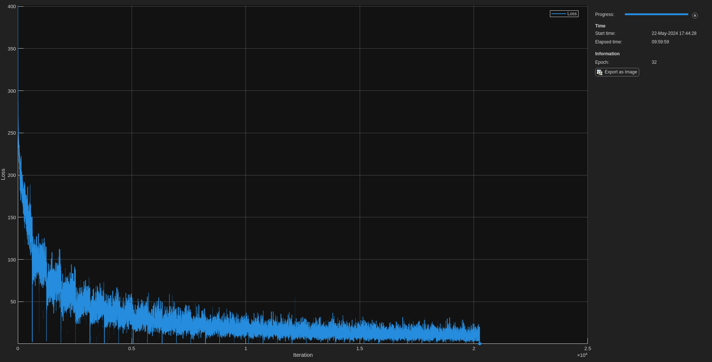

# Create the CLIP model
```matlab
nImEncoder = imageEncoder(Weights="none", LearnRate=1);
nTextEncoder = textEncoder(LearnRate=1e-3);

net = dlnetwork();

net = addLayers(net, nImEncoder);
net = addLayers(net, nTextEncoder);
```

```matlab
imProj = projectionHead("Name", "im_proj");
textProj = projectionHead("Name", "text_proj");

net = addLayers(net, imProj);
net = addLayers(net, textProj);

net = connectLayers(net, "image_encoder", "im_proj");
net = connectLayers(net, "bert_encoder", "text_proj");
```

```matlab
batchSize = 16;
imInputSize = net.Layers(1).Layers(1).InputSize; %nImEncoder.Layers(1).InputSize;
imInputSize(end+1) = batchSize;

randImage = dlarray(randn(imInputSize), 'SSCB');
randInputIDs = dlarray(randi(1000, [1 batchSize 10]), 'CBT');
attentionMask = dlarray(ones(size(randInputIDs)), 'CBT');
segmentIDs = dlarray(ones(size(randInputIDs)), 'CBT');
```

```matlab
net = initialize(net, randImage, randInputIDs, attentionMask, segmentIDs)
```

```matlabTextOutput
net = 
  dlnetwork with properties:

         Layers: [4x1 nnet.cnn.layer.NetworkLayer]
    Connections: [2x2 table]
     Learnables: [95x3 table]
          State: [0x3 table]
     InputNames: {'image_encoder'  'bert_encoder/bert_model/input_ids'  'bert_encoder/bert_model/attention_mask'  'bert_encoder/bert_model/seg_ids'}
    OutputNames: {'im_proj'  'text_proj'}
    Initialized: 1

  View summary with summary.

```

```matlab
tic
[imEmbed, textEmbed] = predict(net, randImage, randInputIDs, attentionMask, segmentIDs);
toc
```

```matlabTextOutput
Elapsed time is 0.846507 seconds.
```

```matlab
textEmbed = squeeze(textEmbed); % Remove the time dimension from text embeddings

size(imEmbed)
```

```matlabTextOutput
ans = 1x2
   256    16

```

```matlab
size(textEmbed)
```

```matlabTextOutput
ans = 1x2
   256    16

```


```matlab
% Quick Check!!!
logTemperature = dlarray(log(100));
[loss, gradientsNet, gradientTemp] = dlfeval(@modelLoss, ...
    net, randImage, randInputIDs, attentionMask, segmentIDs, logTemperature);

```
# Prepare the dataset (minibatchqueue)
```matlab
% https://uk.mathworks.com/help/deeplearning/ug/train-network-using-custom-training-loop.html#TrainNetworkUsingCustomTrainingLoopExample-5
datastore = CLIPDatastore(ImageFolder="./flickr-dataset/Flicker8k_Dataset"); %./Flicker8k_Dataset
ds = shuffle(datastore); %, "PercentageToKeep", 1
```

```matlab
miniBatchSize = 64;
numObservations = numel(ds);
imageInputSize = net.Layers(1).Layers(1).InputSize;

mbq = minibatchqueue(ds, 4, MiniBatchSize=miniBatchSize, ...
    MiniBatchFcn=@processMiniBatch, MiniBatchFormat=["SSCB" "CBT" "CBT" "CBT"]);
```
# Train the Model
```matlab
numEpochs = 32;

numIterationsPerEpoch = floor(numObservations / miniBatchSize);
numIterations = numEpochs * numIterationsPerEpoch;

averageGrad = [];
averageSqGrad = [];
averageGradTemp = [];
averageSqGradTemp = [];

monitor = trainingProgressMonitor(Metrics="Loss", Info="Epoch", XLabel="Iteration");
monitor.Visible = true;

iteration = 0;
epoch = 0;

% Learnable scaling parameter for the logits
logTemperature = dlarray(log(50));

% acceleratedLossFcn = dlaccelerate(@modelLoss);
% clearCache(acceleratedLossFcn); % Whilst I'm debugging

while epoch < numEpochs && ~monitor.Stop
    epoch = epoch + 1;
    shuffle(mbq);

    while hasdata(mbq) && ~monitor.Stop
        iteration = iteration + 1;
        [images, tokens, attentionMask, segmentIDs] = next(mbq);
        
        [loss, gradientsNet, gradientTemp, newState] = dlfeval(@modelLoss, ...
            net, images, tokens, attentionMask, segmentIDs, logTemperature);

        % Update the learnables
        [net, averageGrad, averageSqGrad] = adamupdate(net, gradientsNet, averageGrad, averageSqGrad, iteration);
        [logTemperature, averageGradTemp, averageSqGradTemp] = adamupdate(logTemperature, gradientTemp, averageGradTemp, averageSqGradTemp, iteration);
        net.State = newState;

        % Update tpm
        recordMetrics(monitor, iteration, Loss=loss);
        updateInfo(monitor, Epoch=epoch);
        monitor.Progress = min(100, 100 * iteration/numIterations);
    end
end
```



```matlab

disp("Final Loss: " + extractdata(gather(loss)))
```

```matlabTextOutput
Final Loss: 0.00052653
```

```matlab
fname = "net-" + string(datetime('today')) + ".mat";
save(fname, 'net', 'logTemperature');
```
